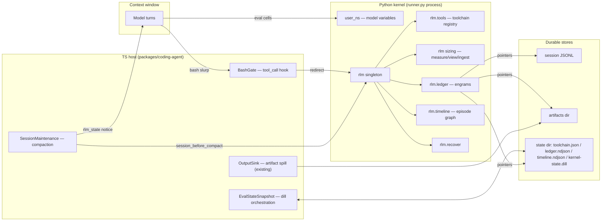

# RLM Biomimetic State Architecture

**The persistent kernel as a programmable computer and compaction memory layer.**

Status: architectural specification (pre-implementation). ID space `B-###` — every requirement below is citable
by tests, mirroring the PART V usage protocol of `requirements/rlm-feature-reference.md`. Where a B-ID realizes
a ported prime-agent feature, the F-ID is cited inline (F-090..F-108 harness-state doctrine, F-170..F-183
snapshot/revival). Sources of ground truth in omp cited as `file:line-ish` anchors current at authoring time.

---

## 0. Thesis and biological model

Context windows fail the way biological working memory would fail without a hippocampus: everything is either
"in mind" (expensive, evictable) or gone. The fix is not a bigger window — it is a **second store with an
index**, plus a **gate** that decides what enters the window at all.

| Biology | This architecture | omp substrate |
|---|---|---|
| Working memory (vivid, tiny, expensive) | Model context window | transcript / branch entries |
| Thalamic sensory gate | Bash gate + sizing wrapper (T1/T2) | `tool_call` hook + `rlm.measure/view` |
| Hippocampus (index, not content; pattern-completion recall) | REPL kernel: ledger + timeline graph (T3) | eval kernel `_STATE.user_ns` + `rlm.*` |
| Neocortex (durable traces) | Session JSONL, artifacts, files, memory backends | `session-storage`, `artifacts.ts`, OutputSink spill |
| Sleep consolidation (episodic → semantic gist) | Compaction + `rlm.consolidate()` | `SessionMaintenance.compact()` |
| Ribot recency gradient (recent memories survive amnesia) | Active-slice manifest, full-fidelity recovery of the last 1/4–1/2 | `firstKeptEntryId` + slice manifest |
| Engram (pointer + reconstruction recipe, not a recording) | Ledger record `{pointer, recipe, digest}` | NDJSON journal under artifacts dir |

**Epistemic compression doctrine (B-001).** Any datum that is *reproducible* (a recipe re-derives it) or
*already durable elsewhere* (session JSONL, artifact file, disk, URL) MUST be represented in context as a
pointer + recipe + measurement — never as a byte copy. Context holds *conclusions and indices*; the kernel
holds *state and procedure*; disk holds *bytes*.

**Three operator tenets realized:**

- **T1 — Gate bash first.** Unbounded byte ingestion happens overwhelmingly through `bash` (cat/curl/git
  log -p/…). Gating targets `bash` only in v1. Memory tools and skill reads are constitutionally exempt:
  100% fidelity, never truncated, never gated (B-070).
- **T2 — REPL as persistent toolchain engine.** Named functions are defined once, registered, persisted as
  source recipes, and *called* thereafter — never regenerated as one-liners. A standing sizing wrapper
  measures every payload before the model decides full view vs chunk vs delegate.
- **T3 — Biomimetic compaction.** The kernel maintains a timeline knowledge graph; compaction consolidates
  (gist + pointers), never destroys; the most recent 1/4–1/2 of context is recoverable at full fidelity
  through a manifest that points into the durable transcript.

---

## 1. System topology



Component homes (B-002):

| Component | Home | New/exists |
|---|---|---|
| `rlm` kernel runtime | `packages/coding-agent/src/eval/py/rlm_runtime.py` (new; loaded by prelude bootstrap) | new |
| Prelude bootstrap step | `packages/coding-agent/src/eval/py/prelude.py` (extend existing guard block) | edit |
| dill snapshot orchestration | `packages/coding-agent/src/eval/py/state-snapshot.ts` + runner control frames | new |
| Bash gate | bundled extension `packages/coding-agent/src/extensibility/extensions/bundled/rlm-gate/index.ts`, `tool_call` handler | new |
| Compaction bridge | `SessionMaintenance` (`session-maintenance.ts`) `session_before_compact` emission point (exists ~:653) + post-compact notice | edit |
| Settings | `settings.getGroup("rlm")` (house pattern: cf. `getGroup("compaction")`, `getGroup("shellMinimizer")`) | new group |
| State dir | `<artifacts>/rlm/` for session-scoped; `~/.omp/state/<project>/rlm/` for project-scoped toolchain | new |

Non-goals (B-003): no second output-truncation convention (OutputSink + artifact spill in
`session/streaming-output.ts` remains the only byte-cap layer); no JS-kernel port in v1 (interfaces are
runtime-agnostic; `eval/js` follows later); no sandboxing changes (kernel trust boundary unchanged, F-208
parity); no gating of any tool other than `bash` in v1.

---

## 2. Kernel runtime layer: the `rlm` singleton

### 2.1 Namespace contract (B-010)

Exactly **one** new binding enters `user_ns`: `rlm`. All capability hangs off it. Rationale: `%who`/dir
hygiene, dill skip-set simplicity, zero collision surface with model-authored variables.

- `rlm` is a plain instance (`_RlmRuntime`), not a module import, constructed by the prelude bootstrap and
  installed via the same pattern as existing helpers (cf. `prelude.py` guard `__omp_prelude_loaded__`,
  runner `_install_builtins`).
- Sub-objects: `rlm.tools`, `rlm.ledger`, `rlm.timeline`, `rlm.recover`. Sizing verbs live directly on the
  singleton (`rlm.measure`, `rlm.view`, `rlm.ingest`, `rlm.replay`) because they are the hot path.
- A synthetic module `sys.modules["rlm_tools"]` hosts rehydrated tool function objects so tracebacks,
  `inspect.getsource`, and pickling-by-reference behave; it is in the snapshot skip-set.
- **Snapshot skip-set (B-011, F-173 parity):** names starting `_`, all prelude exports (`display`, `read`,
  `write`, `env`, `output`, `tool`, `agent`, `completion`, `parallel`, `pipeline`, `log`, `phase`,
  `budget`), plus `rlm` and module `rlm_tools`. These are *re-derived at boot*, never persisted as pickles.

### 2.2 Boot protocol (B-012)

Ordering is load-bearing (F-177 parity: restore BEFORE bootstrap so stale restored helpers are overwritten):

```
1. host spawns runner.py                      (existing kernel.ts path)
2. host → frame {"type":"restore","dir":...}  if kernel-state.dill exists and matches session
     runner: per-var dill load into user_ns; reply {restored:[...], failed:[{name,reason}]}
3. runner execs prelude.py                    (existing, guarded)
4. prelude execs rlm bootstrap                (guarded __omp_rlm_loaded__):
     a. construct _RlmRuntime(state_dir, artifacts_dir)
     b. toolchain rehydrate: exec each tool source into rlm_tools module ns   (§2.3)
     c. ledger index load: ids + measurements only (records stay on disk)     (§4.1)
     d. timeline attach: open journal, replay tail (last 2 epochs); full replay lazy (§4.2)
5. host injects <eval_state_restored> notice when step 2 ran                  (§6)
```

Boot MUST be idempotent and MUST NOT raise on missing/corrupt state files: corrupt journal line → skip and
count; corrupt toolchain.json → empty registry + visible warning in the boot notice (F-108 spirit, CL15
observability: the failure is *reported*, never silent).

### 2.3 Toolchain registry `rlm.tools` (B-020)

**Doctrine: functions persist as source recipes, never as pickles.** dill'd closures break across
interpreter/venv/version drift; source is diffable, auditable, and *is* its own recipe (B-001). The dill
snapshot layer (§6) therefore never carries the toolchain — registration writes through to a journal file,
and boot re-execs sources. This is how the library survives snapshots *without namespace pollution*: it
isn't in the snapshot at all.

Python API:

```python
class ToolMeta(TypedDict):
    id: str                 # ^[a-z_][a-z0-9_]{0,79}$   (F-097 parity)
    version: int            # monotonic, +1 per redefinition (F-099 parity)
    kind: Literal["py", "shell"]
    signature: str          # rendered inspect.signature for py; "{placeholders}" list for shell
    doc: str
    tags: list[str]
    digest: str             # sha256 of source
    created_at: str; updated_at: str          # UTC ISO
    provenance: dict        # {"session": id, "cell": run_id}

# Registration — decorator form (py tools)
@rlm.tools.register(tags=["logs"])
def extract_errors(path: str, *, top: int = 50) -> list[tuple[int, str]]:
    "Frequency-ranked ERROR/FATAL lines from an NDJSON log."
    ...

# Registration — parametrized shell recipe (*NIX toolchains)
rlm.tools.define_shell(
    "error_histogram",
    "grep -E 'ERROR|FATAL' {path} | sort | uniq -c | sort -rn | head -{top}",
    defaults={"top": 50}, tags=["logs"],
)

# Call sites
rlm.tools.extract_errors("/var/log/api.ndjson")     # __getattr__ → callable
rlm.tools.error_histogram(path="x.log")             # shell recipe → runs via rlm.ingest, returns Measurement
rlm.tools.overview(tag=None)                        # bounded catalog: ≤20 rows/kind, 120-char doc
                                                    # truncation, "+N more" marker (F-104 parity)
rlm.tools.source("extract_errors")                  # exact stored source (full fidelity, always)
rlm.tools.drop("extract_errors")                    # tombstone (journal append), never file rewrite-in-place
```

Registration mechanics (B-021):

- `register` captures source via `inspect.getsource`; for REPL-defined functions where `getsource` fails,
  the runner exposes the current cell source (`__omp_current_source__`, new runner builtin set per request
  next to `__omp_current_run_id__`, cf. runner `_install_builtins`) and the registry extracts the `def`
  block by AST match on the function name. No source recoverable → `ToolSourceUnavailable` (fail-fast; the
  model re-defines in a dedicated cell).
- Persistence: append-record journal `toolchain.json` (atomic tmp+`os.replace` writes, F-171 parity;
  save-on-mutate, F-096 parity). Two scopes, resolved in order: project
  `~/.omp/state/<project-slug>/rlm/toolchain.json` (default target) and session `<artifacts>/rlm/` override
  for experiments (`register(..., scope="session")`) — `[project:id]`/`[session:id]` disambiguation prefix
  accepted everywhere an id is accepted (F-102 pattern).
- Rehydration (B-022): boot execs each source inside `rlm_tools` module namespace with builtins + an
  allowlisted import surface (stdlib; anything importable in the kernel). A tool whose exec raises is
  registered as an **unavailable shim** whose call raises the captured import/exec error verbatim (F-027
  pattern) — the catalog never silently shrinks.
- Shell tools route through `rlm.ingest` (§3): output is spooled, measured, ledgered — never returned raw.
- Versioning: same-id re-register bumps `version`, preserves `created_at`, keeps prior source in the journal
  (history is the journal; the JSON snapshot holds head versions only).

File schema (B-023):

```json
{ "version": 1,
  "tools": { "<id>": { "meta": ToolMeta, "source": "def ...", "defaults": {"top": 50} } } }
```

Anti-pollution invariants (B-024): registry rehydration MUST NOT write any name into `user_ns`;
model-authored ad-hoc `def`s in `user_ns` are legitimately dill-snapshotted as plain vars, but *promotion*
(`rlm.tools.register`) is the only durability path; `dir(rlm.tools)` lists tool ids only.

---

## 3. Sizing wrapper — the afferent gate (exact API)

**Standing contract (B-030): measurement is mandatory, payload is opt-in.** No API in this layer ever
returns unbounded content. `view()` is the single sanctioned ingestion verb and enforces a token budget
fail-fast.

### 3.1 Measurement schema (B-031)

```python
class Measurement(TypedDict):
    handle: str            # ledger engram id, "ng_" + 6 hex — stable across the session
    bytes: int
    lines: int
    chars: int
    tokens_est: int        # ceil(chars / 3.5) — deliberate overestimate (safety margin)
    kind: Literal["text", "json", "ndjson", "csv", "binary", "dir"]
    fits: bool             # tokens_est <= budget
    budget: int            # effective inline budget (tokens) at measure time
    head: str              # first min(10 lines, 800 chars) — always safe to print
    structure: dict | None # json/ndjson: {"records": n, "keys": {...top-10 histogram}}
                           # csv: {"rows": n, "cols": [...]}
                           # text: {"line_len_p50": n, "line_len_p99": n}
    pointer: dict          # ledger pointer (§4.1) — where the bytes durably live
```

`repr(Measurement)` renders ONE line — the decision surface the model reads:

```
[rlm ng_4f2a  1.8 MiB  24,331 ln  ~528k tok  ndjson  over-budget ×264 — view(grep=...)/view(offset=...)/map-reduce via parallel()]
```

### 3.2 API signatures (B-032)

```python
def rlm.measure(src, *, budget: int | None = None, name: str | None = None) -> Measurement
    # src: str path | Path | str variable content | any object (falls back to repr length)
    # Never reads more than it must: files are stat'd + head-sampled (first 64 KiB) for kind/structure;
    # line count for files > 8 MiB is estimated from sample density and marked {"lines_est": true}.
    # Side effect: upserts a ledger engram {pointer, digest(head), measurement}; no recipe.

def rlm.ingest(producer, *, name: str | None = None, budget: int | None = None,
               timeout: float = 120.0, cwd: str | None = None) -> Measurement
    # producer: str shell command | zero-arg callable returning str/bytes.
    # Runs producer with stdout/stderr spooled to <artifacts>/rlm/spool/<handle>.out —
    # NEVER through the cell result stream. Registers engram with recipe
    # {"type":"shell"|"py", "body":..., "cwd":...}. Returns the Measurement only.
    # This is the landing pad for gated bash (§5): same bytes, zero context cost, plus a recipe.

def rlm.view(target, *, mode: str = "auto", offset: int = 1, limit: int | None = None,
             grep: str | None = None, query: str | None = None, tail: int | None = None,
             budget: int | None = None) -> str
    # target: engram handle | path | variable. The ONLY sanctioned payload ingestion.
    # Selection: grep (regex, returns matching lines w/ line numbers), query (jq-lite for
    # json/ndjson — reuses prelude _apply_query), offset/limit, tail.
    # POST: len(result)/3.5 <= budget, else raises ViewBudgetExceeded(measurement=...)
    # carrying the refreshed Measurement — the error IS the guidance (narrower grep,
    # smaller limit, or map-reduce). No silent truncation at this layer (CL15).

def rlm.replay(handle) -> Measurement
    # Re-runs the engram's recipe (shell/py), re-spools, re-measures, bumps digest —
    # the pattern-completion verb: cheap re-derivation instead of storage.

def rlm.budget(tokens: int)   # context manager — scoped override of the default view budget
```

Defaults (B-033): view budget 2,000 tokens (settings `rlm.viewBudgetTokens`); hard ceiling remains the
host's inline result cap (OutputSink `DEFAULT_MAX_BYTES` 50 KiB, `streaming-output.ts:11`) — the sizing
budget is the *soft, model-negotiated* layer strictly under it. `tokens_est` uses chars/3.5: a deliberate
~10–15% overestimate for code/logs; the host's true tokenizer remains authoritative post-hoc.

### 3.3 Decision table the wrapper teaches (B-034)

| `tokens_est` vs budget | Standing guidance embedded in `repr` |
|---|---|
| ≤ budget | `view(handle)` — full fidelity inline |
| ≤ 8× budget | targeted: `view(grep=...)`, `view(query=...)`, `view(offset, limit)` chunk walk |
| > 8× budget | map-reduce: chunk via tool (`rlm.tools`), fan out `parallel([...])`/`agent(...)` sub-contexts, aggregate structured results |
| binary / dir | never viewable; `structure` + specialized tool only |

---

## 4. Biomimetic memory hierarchy

### 4.1 Epistemic ledger `rlm.ledger` (B-040)

The engram store — one NDJSON journal `<artifacts>/rlm/ledger.ndjson`, append-only, upsert-by-id (last
record wins; digest change appends a new record, keeping provenance history).

```json
{ "id": "ng_4f2a", "ts": "2026-08-19T17:03:12Z", "epoch": 7,
  "digest": "sha256:…", "bytes": 1882344, "lines": 24331, "tokens_est": 528000, "kind": "ndjson",
  "pointer": { "type": "file", "ref": "/…/artifacts/rlm/spool/ng_4f2a.out" },
  "recipe":  { "type": "shell", "body": "kubectl logs api-7f… --since=2h", "cwd": "/…",
               "deterministic": false },
  "summary": "api pod logs, 2h window",
  "repro":   "snapshot",
  "ttl": "session" }
```

Pointer types (B-041): `file` (absolute path), `artifact` (`artifact://<id>` — OutputSink spill),
`session-entry` (entry id in the session JSONL — the durable transcript), `var` (kernel variable name; only
valid while the dill snapshot covers it), `url`.

Reproducibility classes (B-042) — drive GC and honesty:

| `repro` | Meaning | GC policy |
|---|---|---|
| `deterministic` | recipe alone re-derives identical bytes (pure transform of durable inputs) | spool file collectable; recipe suffices |
| `snapshot` | recipe re-runs but content drifts (live logs, network) | keep pointer while ttl lives; replay = *new* engram |
| `unique` | no recipe (user paste, one-shot observation) | pointer is the only copy — protected, never GC'd within session |

API: `rlm.ledger.get(id)`, `rlm.ledger.find(kind=None, tag=None, since_epoch=None, limit=20)` (bounded),
`rlm.ledger.gc(dry_run=True)` (honors B-042; reports reclaimed bytes).

### 4.2 Timeline knowledge graph `rlm.timeline` (B-043)

In-memory graph = **cache**; journal `<artifacts>/rlm/timeline.ndjson` = truth; recovery recipe = replay.
The graph is therefore never dilled (its own doctrine applied to itself).

Records:

```json
{ "t": "ep",   "id": "ep_0142", "ts": "…", "epoch": 7,
  "kind": "cell|tool|note|compaction|subagent",
  "summary": "parsed api logs; 3 fatal clusters", "refs": ["ng_4f2a"], "tags": ["logs"] }
{ "t": "edge", "src": "ep_0142", "rel": "produced", "dst": "ng_4f2a" }
```

- Auto-episodes (B-044): one per eval cell that touches `rlm.*` (summary = current `phase()` title + first
  display line; refs = engrams touched), one per gated ingestion, one per `agent()` return, one per
  compaction (§4.3). Auto-episodes are cheap rows, not prose.
- API: `rlm.timeline.note(text, refs=[], tags=[])` (explicit episodic write),
  `rlm.timeline.link(a, rel, b)`, `rlm.timeline.recall(query=None, since_epoch=None, tags=None, limit=20)`
  — recall output is bounded one-liners (`ep_0142 e7 cell "parsed api logs…" → ng_4f2a`), never bodies.
- `rlm.timeline.epoch()` → current epoch int; epochs increment only at compaction.

### 4.3 Consolidation protocol — pre-compaction (B-050)

Wired at the existing `session_before_compact` emission (`session-maintenance.ts` ~:653) plus the
auto-compaction path; runs as an **internal cell** (not model-visible; result cap 1 MB — F-007 internal-cell
parity):

```
SessionMaintenance.compact()/auto path, before summarization:
 1. host computes active-slice manifest (host owns token math — compactionContextTokens):
      walk branch entries newest→oldest, accumulate entry tokens until
      sliceTokens = max(0.25·W, min(64_000, 0.5·W))        # W = model context window
      manifest = [{entryId, role, toolName?, tokens, artifactId?, engramRefs?}]
      write <artifacts>/rlm/active-slice-<epoch+1>.json    (atomic)
 2. host → kernel internal cell: rlm._consolidate(epoch=N+1, manifest_path=…)
      kernel: flush ledger + timeline journals
              append compaction episode {kind:"compaction", epoch:N+1,
                    refs:[manifest engrams], "first_kept_entry": <firstKeptEntryId>}
              ledger-register the manifest itself (pointer type "file", repro "unique")
 3. host triggers dill snapshot (§6) — consolidation and snapshot are ordered, snapshot last
 4. compaction proceeds exactly as today (LLM summary / snapcompact untouched)
```

The slice-token formula (B-051) realizes "most recent 1/4 to 1/2": an **absolute** vivid band (64k tokens)
clamped to the proportional window — on a 128k model that is 0.5·W; on ≥256k models it floors at 0.25·W.
Biology note: working-memory span is absolute, not proportional; so is the token mass of "what I was just
doing." Setting: `rlm.recovery.sliceTokens` (default 64000).

Relationship to the kept suffix (B-052): omp compaction already keeps entries after `firstKeptEntryId`. The
manifest covers a *superset* of the kept suffix — including recent entries the summarizer collapsed — so
everything inside the vivid band that the summary dropped remains one call from full fidelity. Fidelity is
achieved by **pointing into the durable session JSONL** (pointer type `session-entry`), never by copying
bytes into the summary.

### 4.4 Post-compaction recovery protocol (B-053)

Immediately after the compaction entry is written, the host injects a standing notice (F-179 analog,
omp-named):

```
<rlm_state>
Your eval kernel persisted through compaction (epoch 8). Variables and rlm.* survive.
Timeline: 147 episodes across 8 epochs. Toolchain: 12 tools (rlm.tools.overview()).
Full-fidelity recent window: rlm.recover.slice()   ·   Orientation: rlm.recover.brief()
</rlm_state>
```

Kernel-side verbs:

```python
rlm.recover.brief() -> str      # ≤30 lines: current phase, last 5 episodes, open engrams
                                # (repro="unique" first), toolchain head, active goals if any
rlm.recover.slice(epoch=None) -> str
    # Bounded index of the active-slice manifest — one line per entry:
    #   [17] assistant  1.2k tok  "designed gate classifier …"      → view: read session-entry e_9f31
    #   [18] tool:bash  8.4k tok  cargo test (spilled)              → view: read artifact://a_22d1
    #   [19] tool:eval  0.9k tok  rlm.ingest kubectl logs → ng_4f2a → view: rlm.view('ng_4f2a', grep=…)
    # NEVER inlines bodies. Each row names the exact rehydration call. (B-030 applies.)
rlm.recover.rehydrate(entry_ids: list, budget: int | None = None) -> str
    # Convenience fan-in: fetches named rows' full bodies via their pointers, concatenated,
    # subject to view budget — ViewBudgetExceeded lists per-row costs so the model drops rows.
```

Recovery walk (the M1.0-shaped ritual, B-054): read `<rlm_state>` → `rlm.recover.brief()` →
`rlm.recover.slice()` → selectively `rehydrate` only rows the resumed task needs. Older epochs: compaction
summary (gist) + `rlm.timeline.recall(since_epoch=…)` + engram recipes (`rlm.replay`). This is pattern
completion, not playback: cheap re-derivation preferred over storage (B-001).

Process-restart recovery composes the same way: dill restore (§6) revives variables; boot rehydrates
toolchain/ledger/timeline from journals; `<eval_state_restored>` names what survived; the recovery walk is
identical. Compaction and restart become the *same* recovery surface.

---

## 5. T1 — Bash gate (PreToolUse layer, TS)

### 5.1 Placement and mechanism (B-060)

Bundled extension registering a `tool_call` handler — omp's PreToolUse. Grounding: handlers may block or
revise input (`ToolCallEventResult { block?, reason?, input? }`, `shared-events.ts:310-332`); events fire at
arg-prep time before scheduling/approval, and revisions are re-validated against the tool schema
(`extensions/wrapper.ts:176-213`). Gate applies **only** to `toolName === "bash"` in v1 (operator directive:
gate bash first; the specialized tools already have bounded readers).

### 5.2 Fidelity floor — checked before all gating logic (B-070)

The following are NEVER gated, NEVER truncated by this layer, in any mode:

- any tool whose name matches `mcp__memory__*` or the active memory-backend tool set (`session-memory.ts`);
- `read` of `skill://`, `rule://` URIs (skills/rules are contracts — partial fidelity corrupts behavior);
- compaction-recovery reads.

Implementation is an allowlist short-circuit at the top of the handler, not a classifier branch — the floor
must hold even when the classifier is wrong. (These tools aren't `bash`, so v1 satisfies this structurally;
the invariant is stated so later gate generations cannot regress it.)

### 5.3 Classifier and actions (B-061)

Classification over the parsed command (reuse the existing bash minimizer/parse surface,
`exec/bash-executor` `buildMinimizerOptions`):

| Class | Detection | Action |
|---|---|---|
| bounded | closed vocabulary of fact pipelines (wc, sort\|uniq -c, diff --stat, *sum, jq with selector, grep -c/-l) | pass |
| slurp-by-stat | `cat/bat/head -c NNN…/base64/xxd/strings <files>` where host `stat` total > `thresholdBytes` | gate |
| slurp-by-shape | `curl/wget` without `-o/-O`; `git log -p`/`git diff` without pathspec + `--stat`; `tar -xO/-tv`; `sqlite3 … .dump`; `grep -r` without `-l/-c`; `find` without `-maxdepth` piped to reader | gate |
| unknown | everything else | pass (OutputSink 50 KiB inline cap + artifact spill remains the backstop) |

Gate action by mode (`settings rlm.gate.mode`, B-062):

- `observe` (rollout default): pass through, but append a measurement footer to the tool result via a
  paired `tool_result` handler: `[rlm] output 1.8 MiB (~528k tok) spilled to artifact://a_22d1 — eval:
  rlm.measure('artifact://a_22d1')`. Zero behavior change; produces the telemetry that tunes the classifier.
- `rewrite`: block with a *teaching* reason (the error is the interface — adversarial-coder doctrine):

  ```
  bash gated: `cat api.ndjson` would slurp 1.8 MiB (~528k tok) into context.
  Run instead (eval):  m = rlm.ingest("cat api.ndjson", name="api_log"); m
  Then: rlm.view(m, grep=...) / rlm.view(m, offset=..., limit=...) — or a registered tool:
  rlm.tools.overview(tag="logs")
  ```

  (Chosen over silent input rewriting: `ToolCallEventResult.input` could transparently wrap the command,
  but a silent rewrite hides the state machine from the model and breaks the T2 learning loop — the model
  must *choose* the kernel to ever start reaching for it first. Revision-based wrapping stays available as
  a later `auto` mode once observe-mode telemetry proves the classifier's false-positive rate ≈ 0.)
- `block`: as `rewrite` but also gates `unknown`-class commands whose stat-resolvable operands exceed
  4× threshold (belt-and-suspenders for hostile pipelines).

Settings schema (B-063):

```ts
interface RlmSettings {
  gate: { enabled: boolean; mode: "observe" | "rewrite" | "block";  // default: observe
          thresholdBytes: number;                                    // default: 262144 (256 KiB)
          allowCommands: string[] };                                 // user escape hatch (exact prefixes)
  viewBudgetTokens: number;                                          // default: 2000
  snapshot: { enabled: boolean; maxBytes: number; debounceMs: number; finalWaitMs: number };
                                                                     // defaults: true, 256 MiB, 1500, 5000
  recovery: { enabled: boolean; sliceTokens: number };               // defaults: true, 64000
}
```

---

## 6. Snapshot and revival (F-170..F-183 → omp runner)

omp's kernel is the bespoke `runner.py` (NDJSON frames, `_STATE.user_ns`), not Jupyter — the port re-homes
prime-agent's snapshot semantics as runner control frames orchestrated by `state-snapshot.ts`:

| B-ID | Requirement | F-parity |
|---|---|---|
| B-080 | Artifacts: `<artifacts>/rlm/kernel-state.dill` + `kernel-state.json` manifest | F-170 |
| B-081 | Atomic write: `<path>.tmp` then `os.replace` | F-171 |
| B-082 | Per-var dill: each top-level name independently; single failure skipped + reported `TypeName: <exc>` ≤200 chars | F-172, F-175 |
| B-083 | Skip-set: §2.1 B-011 list | F-173 |
| B-084 | 256 MiB default cap; over-cap vars reported, never silently dropped from the manifest | F-174 |
| B-085 | Manifest v1: `{version:1, savedNames, skipped:[{name,reason}], bytes, pythonVersion, timestamp}` | F-176 |
| B-086 | Restore ordering: after spawn, BEFORE prelude/rlm bootstrap | F-177 |
| B-087 | Revival notice `<eval_state_restored>…names available again / starting fresh / could-not-restore…</eval_state_restored>` | F-178 |
| B-088 | Standing post-compaction `<rlm_state>` block (§4.4) | F-179 |
| B-089 | Save triggers: 1500 ms debounce after a mutating cell; before compaction (ordered after consolidation §4.3); host beforeExit/SIGINT/SIGTERM with 5000 ms final-save wait | F-180/181/182 |
| B-090 | Restore trigger: kernel (re)start when a fresh snapshot exists for the session lineage; subagent kernels sharing the session key share the live kernel as today — snapshots only bridge dead↔new processes | F-183 |
| B-091 | `dill` dependency: probed at boot. Absent → snapshots disabled with a one-line boot notice naming the install command; toolchain/ledger/timeline recovery (journals, §2.3/§4) is unaffected. Degradation is visible, never silent (CL15). | — |

Division of labor (B-092): serialization runs kernel-side (frame `{"type":"snapshot","dir":…}` handled off
the exec loop so a busy cell can't starve final-save); scheduling/debounce/lifecycle host-side in
`state-snapshot.ts`, wired to the kernel session registry teardown (`kernel-session-registry.ts`) and the
existing shutdown grace path (`py/kernel.ts` `SHUTDOWN_GRACE_MS`).

---

## 7. Step-by-step protocols

**P1 — Gated ingestion (T1→T2 handoff).**
1. Model: `bash cat /var/log/api.ndjson` → gate (`rewrite` mode) blocks with teaching reason (B-061).
2. Model: `eval  m = rlm.ingest("cat /var/log/api.ndjson", name="api_log"); m` → spool + engram `ng_4f2a`,
   one-line Measurement in context (~40 tokens vs ~528k).
3. Model: `rlm.view(m, grep=r"FATAL", budget=1500)` → 62 matching lines, full fidelity, under budget.
4. Recurring need detected → promote: `@rlm.tools.register` a `fatal_clusters(path)` function (P2).
5. Auto-episode links `ep_0142 —produced→ ng_4f2a`; the transcript holds conclusions + the handle only.

**P2 — Toolchain promotion.** Ad-hoc helper proves out in a cell → same cell or next, decorate with
`rlm.tools.register(tags=[…])` → journal write-through (B-021) → next session/process, boot rehydrates
(B-022) → model calls `rlm.tools.fatal_clusters(...)` — zero regeneration. `rlm.tools.overview()` at
orientation time advertises the standing library.

**P3 — Consolidation (every compaction).** Host manifest → kernel `_consolidate` internal cell → journals
flushed, compaction episode appended → dill snapshot → summarization runs unchanged → `<rlm_state>` standing
notice (§4.3–4.4). Failure containment: any consolidation error degrades to plain compaction with a warning
notice — compaction is itself the overflow-recovery path and MUST NOT gain a new failure mode
(mirrors the memory-backend-context swallow in `session-maintenance.ts` `#collectMemoryBackendContext`).

**P4 — Post-compaction recovery.** `<rlm_state>` → `rlm.recover.brief()` → `rlm.recover.slice()` →
`rlm.recover.rehydrate([...])` for the rows the resumed task actually needs; older context via gist +
`timeline.recall` + `replay` (B-054).

**P5 — Process-restart revival.** Registry finds no live kernel → spawn → restore frame (B-086/B-090) →
prelude → rlm bootstrap (journals) → `<eval_state_restored>` names restored/failed vars → P4 walk if a
compaction epoch is also present.

---

## 8. Failure modes and anti-patterns

| Risk | Position |
|---|---|
| dill fragility (closures, C-ext objects, version drift) | dill is for plain data only; functions/infra travel as source recipes (B-020). Per-var isolation + manifest reporting (B-082) makes partial failure visible and non-fatal. |
| Journal growth | Rows are one-liners; ledger GC honors repro classes (B-042); timeline replay is tail-first lazy (B-012). Epoch-scoped archival is a later concern — journals are per-session artifacts. |
| Gate false positives | `observe` rollout mode measures before any behavior change (B-062); `allowCommands` escape hatch; `unknown` class always passes in `observe`/`rewrite`. |
| Double truncation / second convention | This layer never truncates tool results; OutputSink remains the sole byte-cap authority (B-003). `view()` refuses (raises) rather than clips (B-032). |
| Token-estimate dishonesty | chars/3.5 documented as deliberate overestimate; true accounting stays host-side (B-033). |
| Consolidation blocking compaction | P3 failure containment: degrade + warn, never abort compaction. |
| Namespace drift after restore | Restore-before-bootstrap ordering (B-086) guarantees fresh `rlm`/prelude bindings shadow any stale restored ones. |
| Model bypasses the kernel (writes one-liners forever) | The gate's teaching errors + `<rlm_state>`/orientation advertising `rlm.tools.overview()` create the habit loop; observe-mode telemetry quantifies adoption. |

## 9. Delivery map

| Slice | Files | Realizes |
|---|---|---|
| 1. `rlm` runtime + sizing + ledger + timeline | `eval/py/rlm_runtime.py` (new), `eval/py/prelude.py` (bootstrap step), `eval/py/runner.py` (`__omp_current_source__` builtin, internal-cell flag) | B-010..B-044, T2 |
| 2. Snapshot port | `eval/py/state-snapshot.ts` (new), runner snapshot/restore frames, registry/shutdown wiring | B-080..B-092, F-170..F-183 |
| 3. Bash gate | bundled extension `rlm-gate` (`tool_call` + `tool_result` handlers), `settings` group `rlm` | B-060..B-063, B-070, T1 |
| 4. Compaction bridge | `session-maintenance.ts` (manifest + internal cell + notice), `<rlm_state>`/`<eval_state_restored>` injection | B-050..B-054, T3 |

Slices 1–2 are independent of 3–4; 4 depends on 1. Every B-ID above is a test anchor; exact strings
(notices, gate reason template, manifest fields) are machine-checkable in the fidelity-reference style.
